# Test Evidence — Gaseosas del Valle S.A.

This document compiles the tests executed on functions, triggers, views,
and queries in the project, with real results obtained in MySQL.

---

## 1. Functions

### fn_calculate_total_with_iva(id_order)
Calculates an order's total including IVA (tax) based on `order_details`.

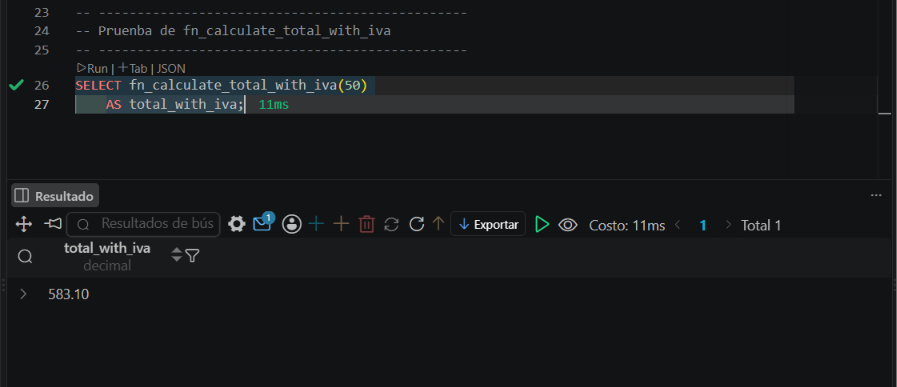

### fn_validate_stock(id_product, id_loc_office, quantity)
Validates whether there is enough stock for a product at a given office.
Tested with 3 cases: sufficient stock, insufficient stock, and no record
in `stock`.

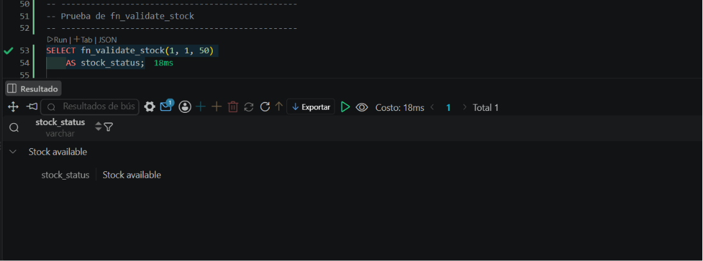
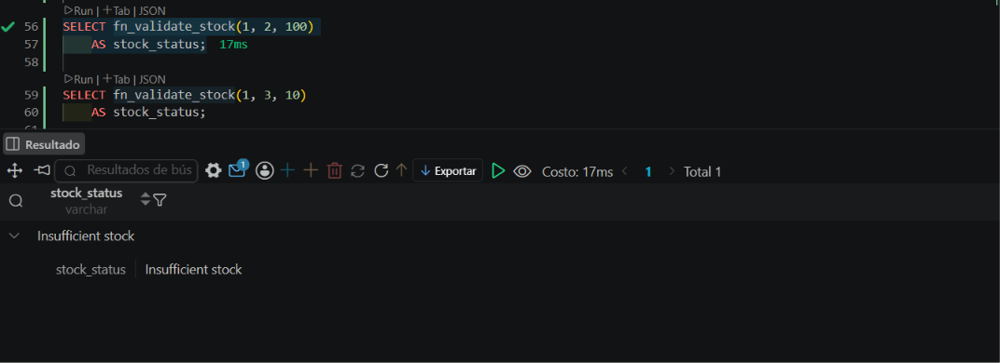
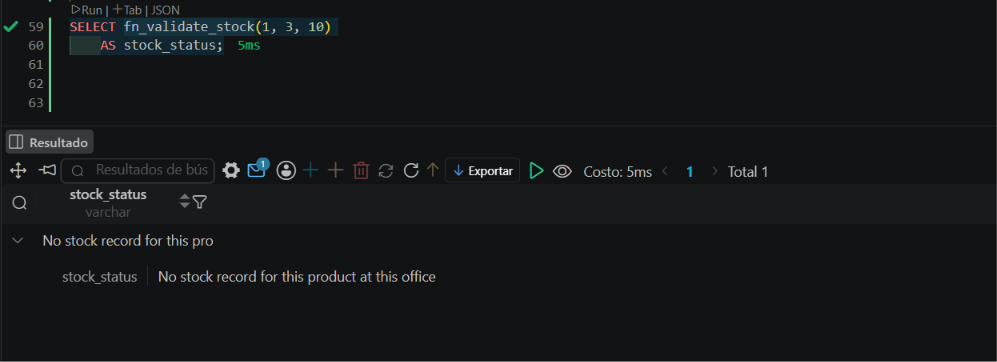

---

## 2. Triggers

### tr_update_stock (AFTER INSERT on order_details)
Automatically decrements the stock of the corresponding office when an
order detail is inserted.

**Before:**
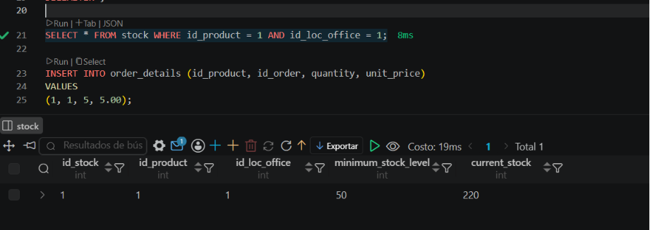

**After (225 → 220 units):**
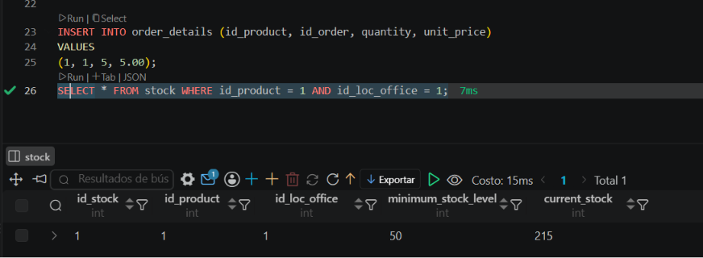

### tr_audit_price_change (AFTER UPDATE on product)
Logs to `price_audit` only when the price actually changes
(`IF OLD.price <> NEW.price`).

**Case 1 — price changes (should log):**

```sql
SELECT * FROM price_audit WHERE id_product = 1;
```
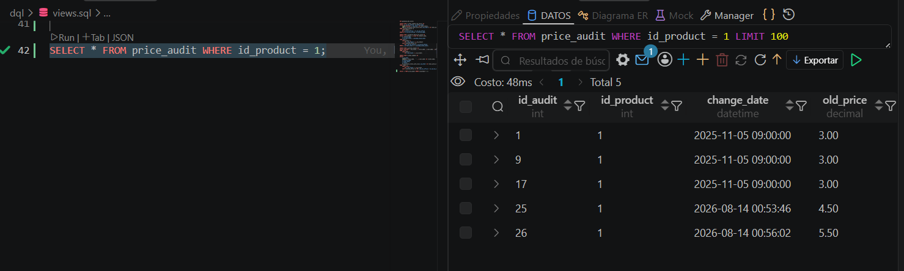

```sql
SELECT price FROM product WHERE id_product = 1;
```
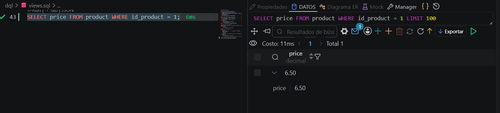

```sql
UPDATE product SET price = price + 1.00 WHERE id_product = 1;
SELECT * FROM price_audit WHERE id_product = 1;
```
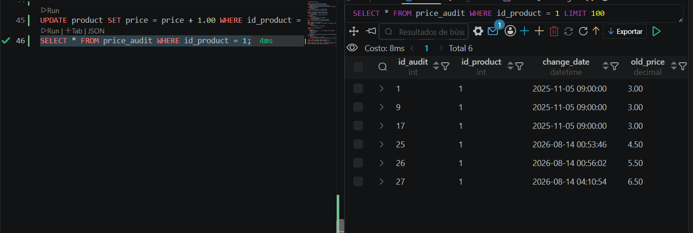

```sql
SELECT price FROM product WHERE id_product = 1;
```
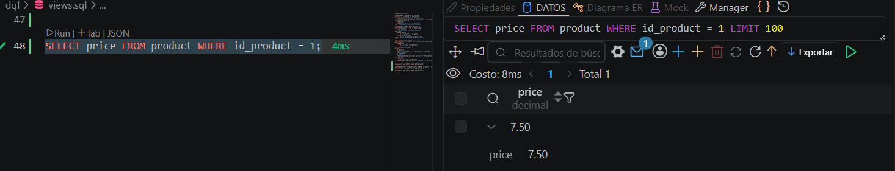

**Case 2 — price does not change (should NOT log):**

```sql
UPDATE product SET name = name WHERE id_product = 1;
SELECT * FROM price_audit WHERE id_product = 1;
```
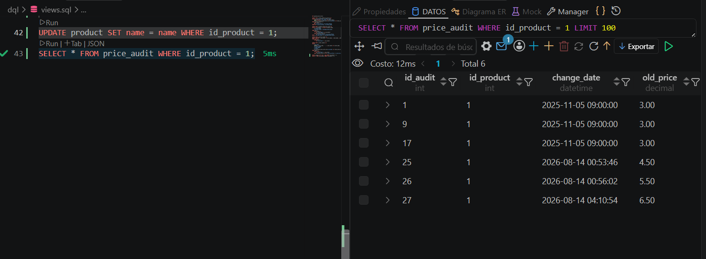

Confirmed: same row count as after Case 1 — the trigger inserted nothing
because the price did not change.

### tr_validate_stock_before_sale (BEFORE INSERT on order_details) — extra
Rejects the insert if the requested quantity exceeds available stock.

```sql
SELECT * FROM stock WHERE id_product = 1 AND id_loc_office = 1;

INSERT INTO order_details (id_product, id_order, quantity, unit_price)
VALUES (1, 1, 500, 5.00);
```
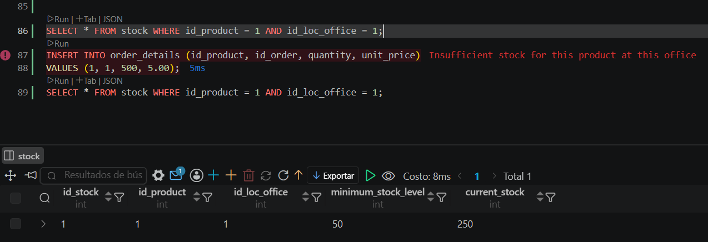

Result: `Insufficient stock for this product at this office`. The
following `SELECT` confirmed the stock did not change — the insert never
completed, so `tr_update_stock` was not triggered.

---

## 3. Views

### v_products_below_min_stock (required)
```sql
SELECT * FROM v_products_below_min_stock;
```
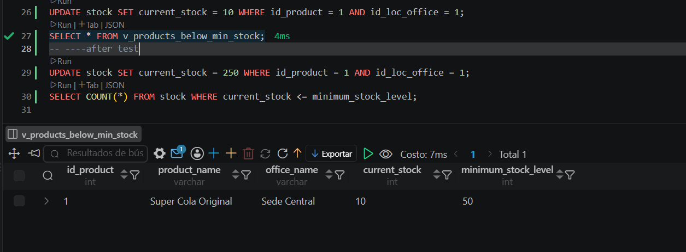

Forced demonstration case:
```sql
UPDATE stock SET current_stock = 10 WHERE id_product = 1 AND id_loc_office = 1;
SELECT * FROM v_products_below_min_stock;
UPDATE stock SET current_stock = 250 WHERE id_product = 1 AND id_loc_office = 1;
```
Result: the view correctly detected the product below minimum
(Super Cola Original, 10 ≤ 50), and stock was restored afterward.

### v_order_summary_by_office (required)
```sql
SELECT * FROM v_order_summary_by_office;
```
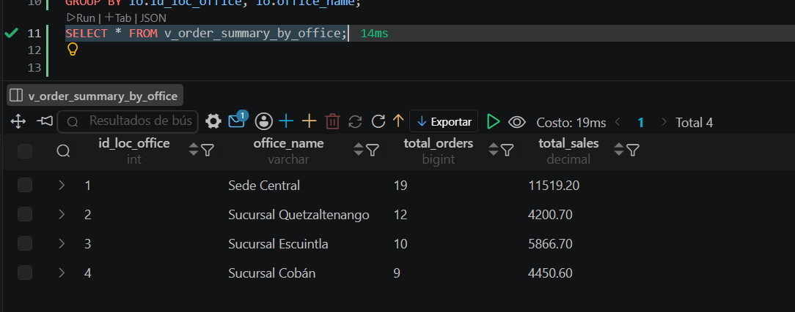

Validation: `total_orders` sum (19+12+10+9=50) matches the total row
count of `orders`.

### v_active_clients (required)
```sql
SELECT * FROM v_active_clients;
```
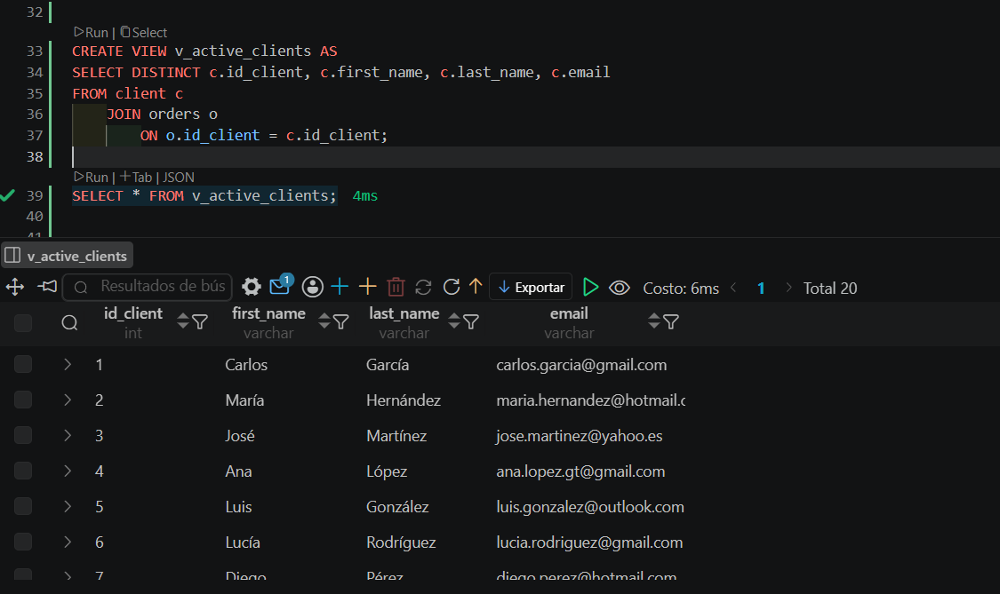

20 active clients confirmed; clients with no orders were correctly
excluded.

### v_order_summary (extra)
Per-order detail view — complements `v_order_summary_by_office`, which
provides the aggregate per office.

```sql
SELECT * FROM v_order_summary ORDER BY id_order;
```
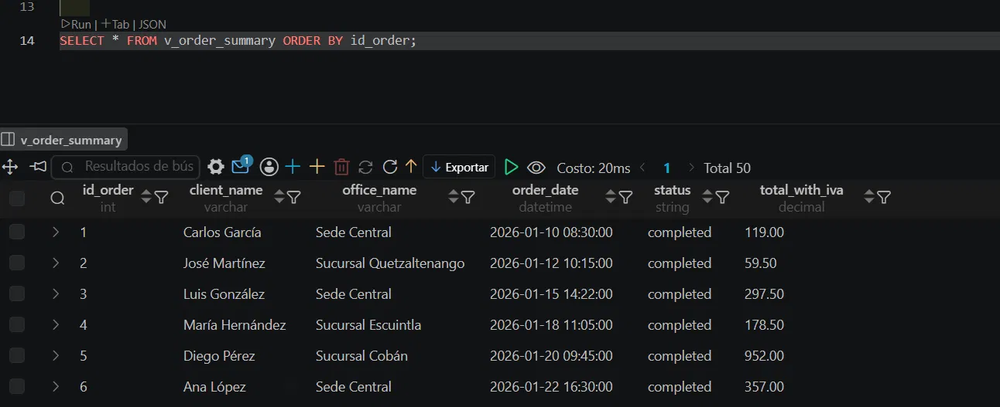

---

## 4. Queries

| # | Query | Evidence |
|---|---|---|
| 1 | Products with stock below minimum | `img/q_stock_below_minimun.png` |
| 2 | Orders between two dates (BETWEEN) | `img/q_date_range.png` |
| 3 | Best-selling products (JOIN + GROUP BY) | `img/q_best_seling.png` |
| 4 | Clients and their order count | `img/q_number_order_client.png` |
| 5 | Clients by partial name (LIKE '%Mar%') | `img/q_like.png` |
| 6 | Products by category (IN) | `img/q_in.png` |
| 7 | Client with the most orders (subquery) | `img/q_most_order.png` |
| 8 | Orders and totals grouped by office | `img/q_total_by_office.png` |

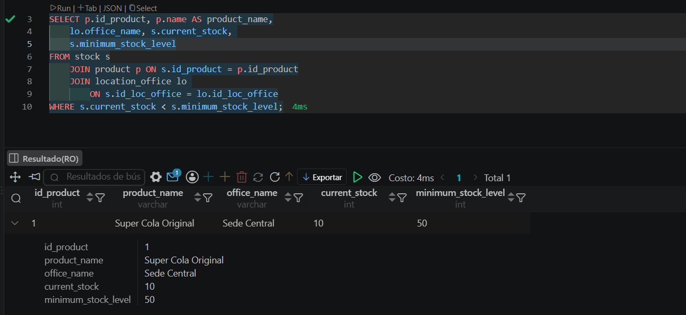
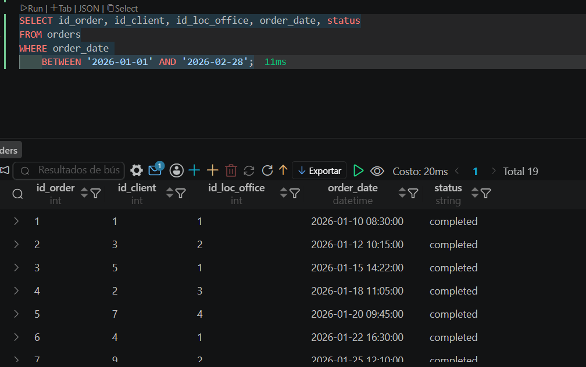
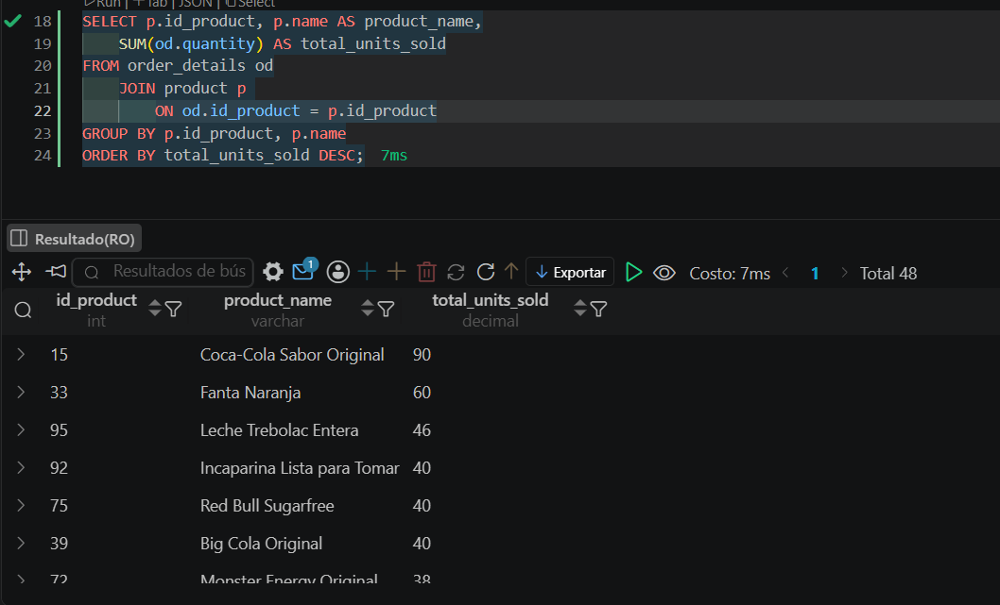
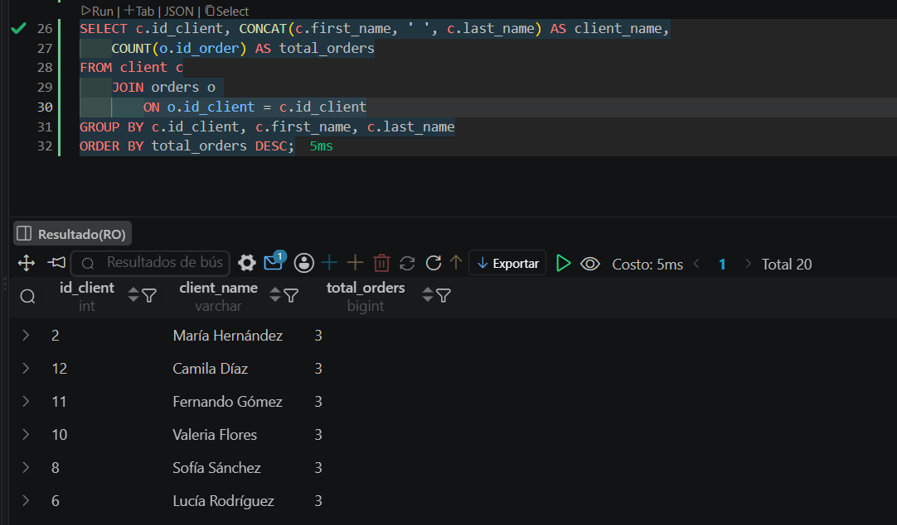
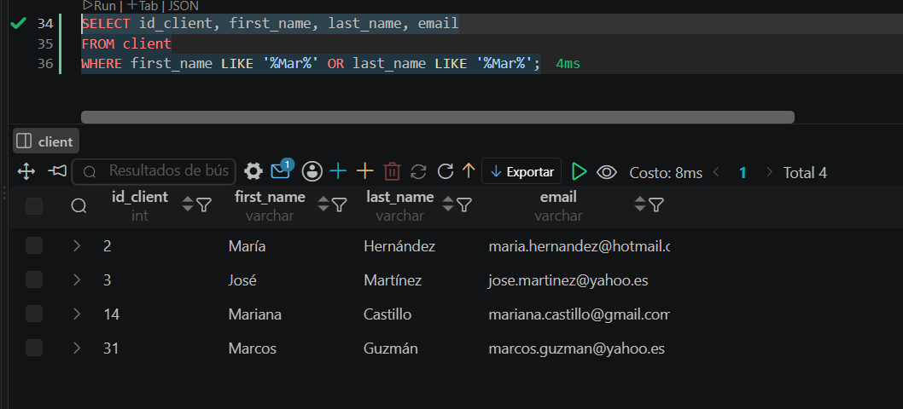
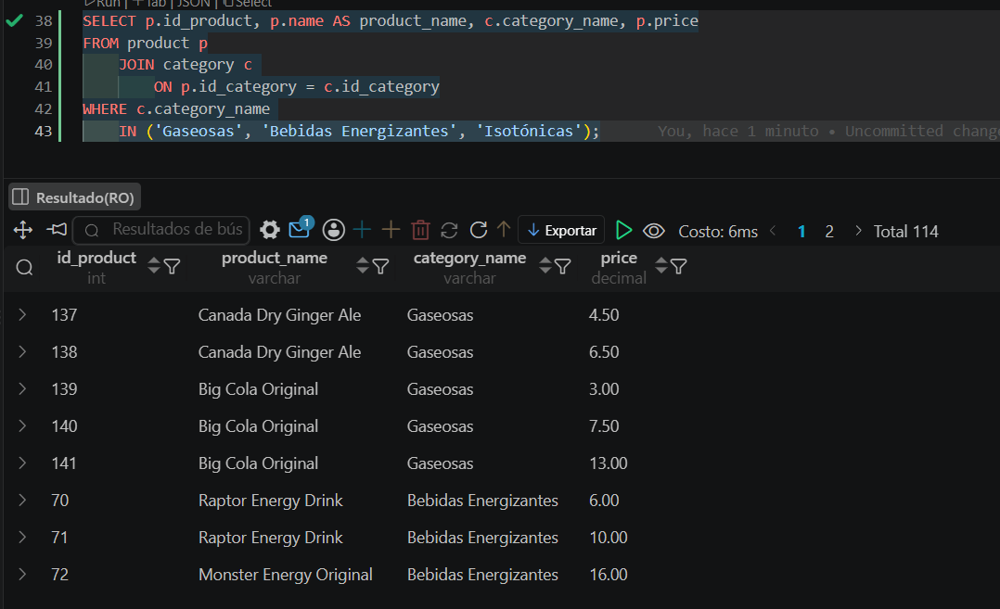
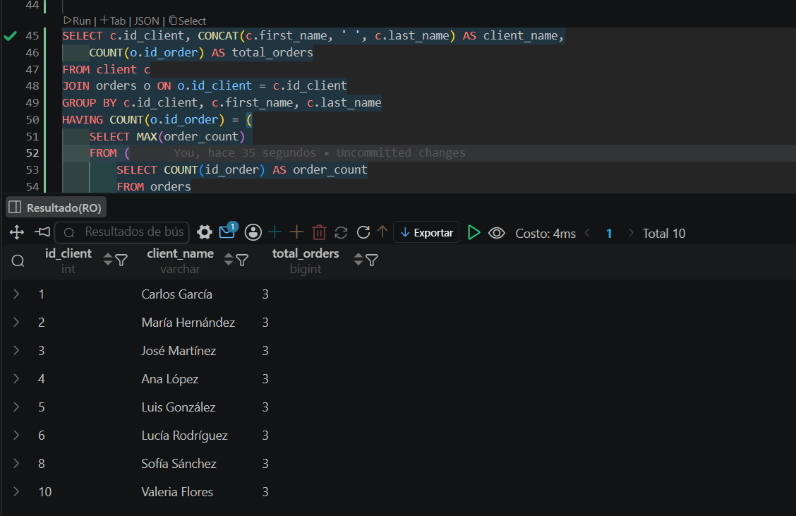
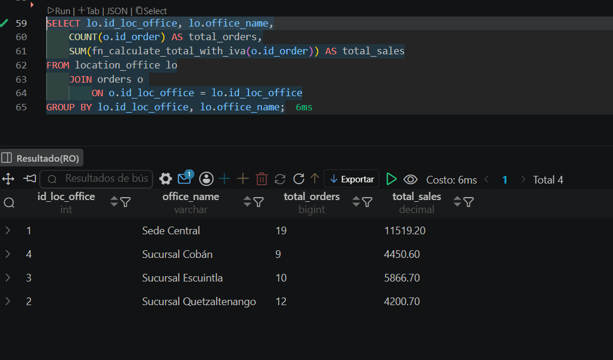